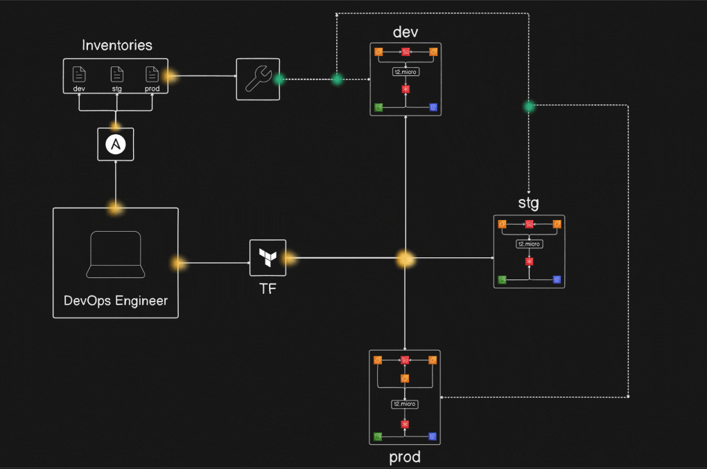

# DevOps Project: Multi-Environment Infrastructure with Terraform & Ansible

## Overview

This project demonstrates how to build and manage a **multi-environment infrastructure (Dev, Staging, Production)** using **Terraform for infrastructure provisioning** and **Ansible for configuration management**.

The infrastructure is deployed on **AWS** and automated to ensure consistency, scalability, and maintainability.

Key capabilities demonstrated in this project:

- Infrastructure as Code using Terraform  
- Multi-environment deployment (Dev, Stg, Prod)  
- Remote state management with S3 and DynamoDB  
- Automated configuration using Ansible  
- Dynamic inventory generation  
- Automated Nginx deployment across servers  

---

# Project Architecture

---

# Tech Stack

- **Terraform** – Infrastructure provisioning  
- **Ansible** – Configuration management  
- **AWS EC2** – Compute infrastructure  
- **AWS S3** – Terraform state storage  
- **AWS DynamoDB** – State locking  
- **Nginx** – Web server deployment  

---

# Project Workflow

## 1. Install Required Tools

Install and configure the following tools:

- Terraform  
- Ansible  

These tools are used for infrastructure provisioning and configuration automation.

---

# 2. Project Structure

The project is divided into two main components:

- **Terraform** → Infrastructure provisioning  
- **Ansible** → Server configuration  

Example structure:

project-root
│
├── terraform
│ └── infra
│
└── ansible
├── inventories
└── playbooks

---

# 3. Terraform Infrastructure Setup

Terraform is used to provision AWS infrastructure for **three environments**:

- Development  
- Staging  
- Production  

Resources created include:

- EC2 Instances  
- S3 bucket for Terraform state storage  
- DynamoDB table for state locking  

Terraform uses a **modular structure** to reuse infrastructure configuration across environments.

Core infrastructure files:

infra/
├── bucket.tf
├── dynamodb.tf
├── ec2.tf
├── output.tf
└── variable.tf

Root Terraform configuration:

terraform/
├── main.tf
├── providers.tf
├── terraform.tf
└── infra/

---

# 4. Infrastructure Provisioning

Terraform is used to:

- Initialize the configuration  
- Generate an execution plan  
- Provision infrastructure resources  

This creates infrastructure for all environments including compute, storage, and state management resources.

---

# 5. Ansible Configuration Setup

After infrastructure provisioning, **Ansible is used to configure servers**.

Separate inventories are maintained for:

- Dev  
- Stg  
- Prod  

Example structure:

ansible/
├── inventories
│ ├── dev
│ ├── stg
│ └── prod

---

# 6. Nginx Deployment using Ansible

Ansible playbooks automate the installation and configuration of **Nginx** across all servers.

Playbook structure:

ansible/playbooks/
└── install_nginx_playbook.yml

An **Ansible role (`nginx-role`)** is used to organize tasks including:

- Installing Nginx  
- Managing the service  
- Deploying a custom HTML page  

---

# 7. Dynamic Inventory Automation

A helper script automatically updates Ansible inventories by fetching **public IPs from Terraform outputs**.

This ensures infrastructure and configuration remain synchronized across all environments.

---

# Final Project Structure

├── README.md
├── terraform
│ ├── infra
│ ├── main.tf
│ ├── providers.tf
│ └── terraform.tf
│
└── ansible
├── inventories
│ ├── dev
│ ├── stg
│ └── prod
├── playbooks
│ └── install_nginx_playbook.yml
└── update_inventories.sh

---

# Infrastructure Cleanup

Terraform can also be used to destroy the entire infrastructure when it is no longer needed. This ensures resources such as compute instances, storage, and databases are removed to avoid unnecessary costs.

---

# Conclusion

This project demonstrates how **Terraform and Ansible work together** to automate infrastructure provisioning and configuration across multiple environments.

Key DevOps concepts demonstrated:

- Infrastructure as Code  
- Configuration Management  
- Multi-environment architecture  
- Infrastructure automation  
- Scalable deployment workflows
